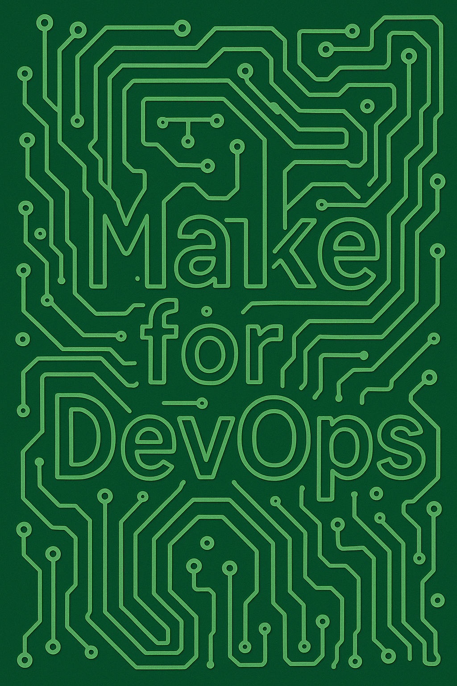

<!-- Speaker: Both -->

# Galaxy Brain DevOps

Hardy Pottinger  
John H. Robinson, IV

### UC-Tech 2026

Note:
  Duration: ~30 seconds
  Beat: Title card. Let the room settle. Hardy and John introduce themselves briefly — one sentence each. Hand off to John to open Act I.
  Source: README.md

---

# The Problem Is Not Knowledge

It is access.

Note:
  Duration: ~30 seconds
  Beat: Land the thesis before the story. Organizations already have the knowledge — it just can't reach the person who needs it at 3 A.M. This single slide frames everything that follows.
  Transition: "Let me tell you about Sage."

---

<!-- Speaker: John -->

# Meet Sage

Note:
  Duration: ~1 min
  Beat: Set up Sage as the audience stand-in. Not a junior engineer — a capable person put in an impossible situation. The problem is the system, not the person.
  Source: resources/01-why_make.md, Chapter 1 opening
  Transition: The incident is real. The docs are real. What happens next is the problem.

---

# The Docs Exist

- Runbook :check_mark_button:
- Wiki :check_mark_button:
- Slack history :check_mark_button:

Note:
  Duration: ~1 min
  Beat: Emphasize that documentation failure is NOT "we didn't write it down." Sage finds docs. They're just not actionable under pressure. Three different places to look, none of them give Sage a command to run.
  Source: resources/01-why_make.md

---

# Knowledge Without Access Is Not Knowledge

Note:
  Duration: ~30 seconds
  Beat: The quiet gut-punch. Sit on this for a beat. The organization invested in documentation. It failed anyway — not because it was wrong, but because it wasn't accessible in the moment of need.
  Transition: So why does this keep happening?

---

# Every Team Has a Sage Story

- New engineers take longer to reach confidence
- Teams without runbooks resolve incidents more slowly
- Senior engineers become the bottleneck

Note:
  Duration: ~1 min
  Beat: Make it systemic. This isn't one team's problem. The goal here is to get heads nodding in the audience before we propose the solution.
  Source: resources/01-why_make.md

---

<!-- Speaker: John -->

# Why Documentation Fails

Note:
  Duration: ~30 seconds
  Beat: Transition slide. John signals we're now diagnosing the root cause, not just the symptom. Keep it brief — the next four slides each name a failure mode.
  Source: resources/01-why_make.md

---

# Docs Drift

- Systems change faster than docs
- No compiler, no tests, no alarm

Note:
  Duration: ~45 seconds
  Beat: Documentation has no feedback loop. Code that drifts breaks CI. Docs that drift just quietly lie. No one knows until someone follows the runbook and it doesn't work.
  Source: resources/01-why_make.md

---

# Completeness Is the Enemy

- More complete = harder to maintain
- Harder to maintain = faster drift

Note:
  Duration: ~45 seconds
  Beat: The comprehensiveness paradox. The more thorough you try to be, the faster it rots. Good intentions, bad outcomes.
  Source: resources/01-why_make.md

---

# Engineers Don't Know What's Possible

- No discovery mechanism
- Tribal knowledge fills the gap

Note:
  Duration: ~45 seconds
  Beat: The discovery problem. Even if docs exist, engineers don't know to look for them. They ask a senior instead. That senior becomes a bottleneck. The knowledge is there — it just isn't findable.
  Source: resources/01-why_make.md

---

# Team Lore Diverges From Docs

- What people actually do  
vs.
- What the docs say

Note:
  Duration: ~45 seconds
  Beat: Over time, the real procedure and the documented procedure become two different things. Neither is wrong — they just aren't the same. New people learn the documented version. Senior people use the real one. No one reconciles them.
  Transition: So what if the documentation couldn't drift? What if it was the thing you actually ran?

---

<!-- Speaker: Both — Hardy sets up, John elaborates -->

# Samvera 2017

Note:
  Duration: ~30 seconds
  Beat: Hardy: "I want to tell you about the moment I understood what Make could do." Set the scene — Samvera is the library software community. 2017 conference. Hardy is in the audience.
  Source: resources/Foreword.md, notes/outline.md Act III

---

# One Demo Changed Everything

- Live terminal
- Vagrant up
- Make targets

Note:
  Duration: ~1 min
  Beat: Hardy describes watching John do a live demo — spun up an environment and ran Make targets in real-time, in front of the room. The audience went quiet. Hardy: "I didn't know you could do that." Hand to John to elaborate.
  Source: resources/Foreword.md

---

# Make Is 50 Years Old

- Survived because it solves timeless problems
- Encodes dependencies, relationships, intent
- Available everywhere

Note:
  Duration: ~1 min
  Beat: John takes over. Make outlasted the tools it was invented to build. It's on every Unix-like system, no install required. The reason it survived isn't nostalgia — it's that the problems it solves never went away.
  Source: resources/01-why_make.md

---

# Reframe Make

- Not a build tool
- An operational interface
- A knowledge catalog

Note:
  Duration: ~1 min
  Beat: The conceptual pivot. This is the frame the rest of the talk builds on. Make is not a C compiler driver. It's a way to expose what a project knows how to do.
  Transition: So what does that actually mean in practice?

---

<!-- Speaker: John -->

# Executable Knowledge

- Commands that document AND perform
- The interface is the documentation
- No drift possible

Note:
  Duration: ~1 min
  Beat: Define the term that runs through the whole talk. Executable knowledge is not documentation about commands — it IS the commands. When the docs ARE the thing you run, they can't drift from reality.
  Source: resources/02-executable_readme.md

---

# Static vs. Executable

| Static | Executable |
|--------|-----------|
| Describes | Does |
| Can drift | Self-validates |
| Requires interpretation | Runs directly |
| Silently wrong | Fails visibly |

Note:
  Duration: ~1 min
  Beat: The contrast table makes the argument concrete. A static runbook can be wrong and no one knows. An executable one fails loudly the moment it drifts. That's the feedback loop docs never had.
  Source: resources/02-executable_readme.md

---

# Write Targets Like You're Writing for Sage

- Clear intent
- Safe defaults
- Helpful output

Note:
  Duration: ~1 min
  Beat: Practical design guidance. When naming and writing targets, ask: "Could Sage run this at 3 A.M. without asking anyone?" If not, fix the name, add a description, add guardrails.
  Source: resources/02-executable_readme.md

---

# The Executable README

- `make help` as the entry point
- Every project answers the same first question
- What can I do here?

Note:
  Duration: ~1 min
  Beat: The Executable README pattern. A project that responds to `make help` with a clear list of operations has already answered the first question every new engineer asks. Show a before/after: 47-page setup doc vs. `make help` output.
  Source: resources/02-executable_readme.md, before/after example

---

<!-- Speaker: John -->

# Systems That Teach

Note:
  Duration: ~30 seconds
  Beat: Transition frame. John signals a shift from "what Make does" to "what Make enables." A well-made Makefile doesn't just run commands — it teaches people what the project knows.
  Source: resources/21-make_as_your_personal_learning_tool.md

---

# Make Help Is Always the Answer

- One command, any project
- Reveals everything you can do
- No prior knowledge required

Note:
  Duration: ~1 min
  Beat: The universal entry point. `make help` is the same in every project — once an engineer knows this pattern, they can onboard to any project that uses it. Knowledge becomes portable.
  Source: resources/02-executable_readme.md

---

# Build Knowledge As You Work

- Capture what you just figured out
- Name it for the problem, not the solution
- Start broad, refine later

Note:
  Duration: ~1 min
  Beat: The personal runbook pattern. Every time you search for the same command twice, that command belongs in your Makefile. The act of capturing it teaches you the tool better. Reference the progression from week-1 basics to month-6 teaching others.
  Source: resources/21-make_as_your_personal_learning_tool.md

---

# Knowledge Flows From Personal to Team

- What you capture for yourself
- becomes what you share with your team
- becomes the project standard

Note:
  Duration: ~1 min
  Beat: The natural progression. Personal runbooks become team runbooks become operational standards. No policy required — it happens organically when the tooling makes sharing easy.
  Transition: Let me show you what this looks like at scale.
  Source: resources/21-make_as_your_personal_learning_tool.md

---

<!-- Speaker: Hardy -->

# A Real Project

Note:
  Duration: ~30 seconds
  Beat: Hardy opens the actual EKS project used at UCSF. No slides needed — the terminal is the demo. This slide is just the transition frame: "Here it is. Let's see what it knows."

---

# Years of Operational Knowledge

- `make help`

Note:
  Duration: ~1.5 min
  Beat: Run `make help` live. Let the audience read the output. Dozens of targets, organized by function: deploy, debug, recycle, diagnose. Each one is a piece of knowledge that was captured the day someone figured it out.
  Beat: Hardy narrates briefly — "This target was added when we hit the IMDS problem. This one was added after a node recycling incident. Each one has a story."
  Transition: Speaking of stories — let me tell you about one of those targets.

---

# The Project Knows More Than We Do

Note:
  Duration: ~30 seconds
  Beat: Set up Act VII. The punchline isn't just that the Makefile is useful — it's that it preserves knowledge beyond human memory. Hardy: "There was a day when I couldn't remember what we'd done, but the project could."

---

<!-- Speaker: Hardy -->

# The IMDS Problem

- Customer can't push Docker images
- ECR login failing
- Vague memory: "something about token hops"

Note:
  Duration: ~45 seconds
  Beat: Set up the incident. Docker-in-Docker workflow on EKS. Customer hits an auth failure. Hardy vaguely remembers solving something like this before — but can't remember the details.
  Source: transcripts/a-partial-reconstruction-of-a-session-involving-a-Makefile.txt

---

# The AI Found It

- `debug-imds` target
- Claude got excited
- "I think I know what this is"

Note:
  Duration: ~1 min
  Beat: Hardy brought in Claude to help investigate. Claude scanned the Makefile, found the `debug-imds` target, and immediately started reconstructing the problem. The project's vocabulary gave the AI the context it needed to reason.
  Source: transcripts/a-partial-reconstruction-of-a-session-involving-a-Makefile.txt

---

# Reconstruct the Chain

- Container → dind daemon → pod network → host NIC → IMDS
- Three hops
- Default hop limit: 1

Note:
  Duration: ~1 min
  Beat: Walk the audience through the DIND chain. EC2 Instance Metadata Service has a configurable hop limit for IMDSv2 tokens. Default is 1. Three hops = token expires before it arrives. This is the "token hops" thing Hardy half-remembered.
  Source: transcripts/a-partial-reconstruction-of-a-session-involving-a-Makefile.txt

---

# The Project Remembered

- Permissions wall hit: pivoted
- Baked hop-limit 3 into launch template
- Recycled nodes

Note:
  Duration: ~1 min
  Beat: Hit a permissions wall (ec2:ModifyInstanceMetadataOptions denied), pivoted to the launch template approach. EKS created LT version 30 instead of using version 29 — brief detour. Nodes came up at hop limit 3. Problem solved.
  Beat: The punchline: Hardy's memory was vague. The project's memory was perfect. The Makefile remembered what the humans forgot.
  Transition: That's knowledge preservation. Now let me show you knowledge creation.
  Source: transcripts/a-partial-reconstruction-of-a-session-involving-a-Makefile.txt

---

<!-- Speaker: Hardy -->

# DEVEXP-309

- NVMe not mounting on all nodes
- Root EBS at 50-90%
- Should be under 5%

Note:
  Duration: ~45 seconds
  Beat: Set up the mystery. The devex-actions-cluster should be using NVMe for Docker storage. Root EBS should be nearly empty. It's not. Why?
  Source: transcripts/DEVEXP-309-NVMe-Mount-Investigation-and-Containerd-Root-Directory-Diagnosis.txt

---

# Investigate With the Makefile

- `debug-docker-storage`
- `debug-ephemeral-storage`
- `recycle-node`

Note:
  Duration: ~1 min
  Beat: Walk through the investigation using existing targets. Each one was added by someone who hit a similar problem before. The Makefile already knew how to look at this.
  Source: transcripts/DEVEXP-309-NVMe-Mount-Investigation-and-Containerd-Root-Directory-Diagnosis.txt

---

# Five Bugs Found

1. Older LT versions on some nodes
2. Userdata exits early (set -euo pipefail)
3. DirectoryOrCreate masks mount failures
4. blkid suppresses errors
5. grep device filter is fragile

Note:
  Duration: ~1 min
  Beat: The investigation turned up 5 distinct bugs in the launch template, userdata script, and values.yaml. This is the kind of layered complexity that only emerges through careful hands-on investigation.
  Beat: Key point: the ticket is still open. We found the bugs. We haven't fixed them yet. That's OK — that's where Act IX comes in.
  Transition: But here's what I want you to notice: the investigation grew the Makefile.
  Source: transcripts/DEVEXP-309-NVMe-Mount-Investigation-and-Containerd-Root-Directory-Diagnosis.txt

---

# Knowledge Was Created

- New diagnostics added
- New understanding captured
- Ticket still open — that's OK

Note:
  Duration: ~45 seconds
  Beat: The Makefile isn't a museum. It's a living system. The investigation added new targets, new diagnostics, new understanding. The problem isn't solved — but the project knows more than it did before.
  Transition: And speaking of that open ticket — we'd like your help with it.

---

<!-- Speaker: Both -->

# Your Turn

Note:
  Duration: ~30 seconds
  Beat: Both speakers. Hardy: "We're going to open the EKS project right now and let you guide us." John: "There's an open mystery — DEVEXP-309. We have the Makefile. You have questions. Let's see what we find."

---

# The Mystery Is Still Open

- `make help`
- You pick the path
- Discovery is the point

Note:
  Duration: ~7-8 min (live demo)
  Beat: This slide stays up during the live demo. Audience suggests investigation directions. Speakers run commands, narrate findings, add to the Makefile live if anything new emerges.
  Beat: Success condition: the audience sees the project teaching. Resolution is a bonus.
  Fallback: If demo environment is unavailable, walk through the DEVEXP-309 transcript instead — the story is strong enough to carry without a live terminal.

---

<!-- Speaker: Hardy -->

# An Unexpected Observation

Note:
  Duration: ~30 seconds
  Beat: Hardy: "Something happened during these investigations that I didn't expect." Pause. Let the audience wonder what's coming. This act is short but lands a big idea.
  Source: resources/20-the_future_of_make_in_devops.md

---

# AI Agents Need What Humans Need

- Discoverability
- Clear vocabulary
- Executable intent

Note:
  Duration: ~1 min
  Beat: The observation: when Hardy brought Claude into the IMDS investigation, it worked because the Makefile gave the AI the same things it gives humans. A good Makefile is already a good AI interface. You don't need to do anything special.
  Source: resources/20-the_future_of_make_in_devops.md

---

# Make Amplifies Good Practices

- Strong executable knowledge → better human outcomes
- Strong executable knowledge → better AI outcomes
- The practices are the same

Note:
  Duration: ~1 min
  Beat: "Vibe engineering" — seasoned professionals using AI to accelerate while staying accountable. Make doesn't replace judgment. It creates the conditions where judgment, human or AI, can operate effectively.
  Transition: John's going to show you what that looks like when you push it to the limit.
  Source: resources/20-the_future_of_make_in_devops.md

---

<!-- Speaker: John -->

# One Instruction

Note:
  Duration: ~30 seconds
  Beat: John: "I want to tell you about Avalon." Short pause. "I gave Codex one prompt."

---

# Make This a Proper Prod Environment

- Use a Makefile
- Make me proud

Note:
  Duration: ~1 min
  Beat: Read the prompt aloud, slowly. Let it land. The audience should be skeptical — that's too vague to work, right? John: "First attempt."
  Source: transcripts/one-shotting-Avalon-with-MakefileSage-and-Codex.md

---

# First Attempt

- Production Docker Compose stack
- Full Makefile with `make help`
- Env guards, Rails hardening, secrets management, tests

Note:
  Duration: ~1 min
  Beat: Walk through what came back. Not a sketch — a complete, production-ready setup. Immutable containers, healthchecks, restart policies, proper secrets management. On the first try.
  Source: transcripts/one-shotting-Avalon-with-MakefileSage-and-Codex.md

---

# Why It Worked

- The project already had executable knowledge
- Codex reasoned from what the project knew
- One instruction was enough

Note:
  Duration: ~1 min
  Beat: The thesis in action. Avalon already had a Rails structure, Docker conventions, existing compose files — executable knowledge the AI could reason from. The Makefile wasn't magic. It was the foundation that made the magic possible.
  Transition: Which brings us back to Sage.
  Source: transcripts/one-shotting-Avalon-with-MakefileSage-and-Codex.md

---

<!-- Speaker: Both -->

# Back to Sage

Note:
  Duration: ~30 seconds
  Beat: Show sage-before.png. Sage at 3 A.M., alone, searching through docs that don't help. Then show sage-after-make.png. Sage running `make help`, finding the answer. The same person, different system.
  Images: sage-before.png, sage-after-make.png

---

# Can Your System Teach the Next Person?

Note:
  Duration: ~1 min
  Beat: The question that lands the whole talk. Not "do you have documentation?" — "can your system teach?" There's a difference. Sit on it for a beat. Let the audience answer it internally.
  Beat: Hardy and John can share this slide — alternate the question with eye contact to the room.

---

# We've Been Writing a Book

Note:
  Duration: ~30 seconds
  Beat: Show the cover. Keep it brief. "We've been writing a book about this. Hardy and John — and Claude, as collaborator." Don't over-explain. Let the room react.
  Images: make-for-devops-cover.png
